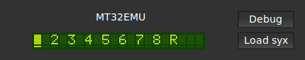
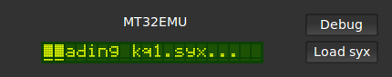
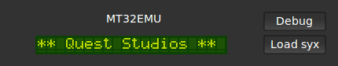

mt32emu_lv2
============

mt32emu_lv2 is a LV2 plugin that approximately emulates the Roland MT-32, CM-32L and LAPC-I synthesizer modules.
To do this emulation it uses the Munt library (which is included in the repository). Like the famous Roland D-50, the MT-32
generates sound using a combination of Linear Arithmetic synthesis and samples for the attack transients.

As a LV2 plugin it can be used in plugin hosts such as [Carla](http://kxstudio.sourceforge.net/Applications:Carla),
or directly in some sequencers such as [QTractor](http://qtractor.sourceforge.net/qtractor-index.html). It has been
tested in the aforementioned programs, but should work with others as well.

It has a basic GUI that shows the current part status (similar to mt32emu_qt) and can be used to load syx files.







Features
---------

- LV2 instrument plugin (1 MIDI in, 2 audio channels out)
- Linear Arithmetic synthesis with up to four partials per voice, up to 32 partials polyphony
- NTK GUI with LCD display
- SysEx file loading through GUI
- State save/restore. The entire SysEx state of the emulator is stored and written, which is useful to associate a certain MT-32 state with a bus in qtractor
- Reverb settings can be configured through SysEx or overridden externally through plugin parameters

Known issues
--------------

- GUI is very basic (I could use help with design)
- Aimed at Linux. The underlying Munt library is portable, and as NTK is used for the UI, portability to Windows or MacOSX should be possible, but was never tested.
- No way to edit instrument settings in the GUI; however it is possible to load syx banks provided by an external SysEx librarion

Install
---------

This will build and install the plugin:

```bash
mkdir build
cd build
cmake ..
make
sudo make install
```

### Cmake options

These options can be passed on the `cmake` command line to configure the build

```
-DCMAKE_BUILD_TYPE:STRING=RelWithDebInfo|Release|Debug 

Build in Release with debug info (default)/Release/Debug mode
```

```
-DCMAKE_INSTALL_PREFIX:PATH=/opt/music

To install to an alternative prefix (instead of `/usr/local`)
```

Copying the ROMS
-----------------

Like Munt standalone, this plugin needs a copy of the MT-32 (or CM-32) control
and PCM ROMs. These ROMs need to be installed manually to the LV2 bundle path
(`$PREFIX/lib/lv2/mt32emu.lv2`), otherwise there will be no sound output. Their
names should be `control.rom` and `pcm.rom` respectively.

For example:
```bash
cp MT32_CONTROL.ROM $PREFIX/lib/lv2/mt32emu.lv2/control.rom
cp MT32_PCM.ROM $PREFIX/lib/lv2/mt32emu.lv2/pcm.rom
```

If everything goes alright, the plugin will log the following while loading:

    Control ROM: MT-32 Control v1.07
    PCM ROM: MT-32 PCM ROM

Otherwise it will print, along with some more verbose information

    Unable to open ROM images, not activating

SysEx banks
------------
Many preset patch banks in SysEx (.syx) format can be found for the MT-32, for
example at [Quest Studios](http://www.queststudios.com/roland/banks.html).
Just like the standalone Munt emulator, the LV2 plugin can accept these as inline SysEx events or
when loaded through the GUI.

Important
----------
This LV2 plugin behaves differently from most other LV2 softsynths in a few respects:

- Most instrument plugins use only MIDI channel 1 or ignore MIDI channels altogether. For now I have decided
to keep the 'multi-timbral' part of the emulation - maybe a one-MT32-part plugin could be useful at
some point, but it would no longer really be an emulator. The default setting the MT-32 has parts on MIDI channel 2-9, 
as well as a rhythm part on MIDI channel 10. **Sending events on MIDI channel 1 will thus have no effect by default**

- Another difference with other plugins is that this plugin accepts program changes per channel. 
Some hosts, for example Carla, may have to be configured to let those through
(in the host plugin settings uncheck "Map Program Changes", check "Send Bank/Program Changes").

MIDI
======

The MT-32 is a pre-GM device, but most of the messages and controllers are similar.

### MIDI Messages

Munt responds to the following MIDI messages:

 Message type                   | Description
 -------------------------------|-------------------------
 `8x` (Note Off)                | Release a note
 `9x` (Note On)                 | Play a note
 `Bx` (Control Change)          | Change controller value (see 'MIDI Controllers' section below)
 `Cx` (Program Change)          | Change current program
 `Ex` (Pitch Bend)              | Change pitch of notes. The pitch bender range is determined by RPN 0.

### MIDI Controllers

The following MIDI controller events are implemented.
All controller changes take effect immediately:

 CC, RPN or NRPN                | Parameter
 -------------------------------|-------------------------
 CC 1 (Modulation Wheel MSB)    | Modulates pitch
 CC 7 (Main Volume MSB)         | Volume Coarse
 CC 10 (Panning MSB)            | Stereo Panning (note: reversed as compared to GM)
 CC 11 (Expression MSB)         | Expression (another volume factor)
 CC 64 (Sustain Pedal)          | Enable/Disable Sustain
 CC 121 (Reset All Controllers) | Set all controllers to default values
 CC 123 (All Notes Off)         | Release all notes on channel
 CC 124 - CC 127                | Release all notes on channel, and release hold panel
 RPN 0 (Pitch Bender Range)     | Range of pitch bend (0..24 halftones)

TODOs
------

- How useful can this be made without the Roland ROMs, can we make a standalone
  LA synth? Is it 'just' a matter of providing our own presets and samples?
- Can the native sampling speed be changed to avoid having to resample from 32000Hz?
  Especially when using a custom PCM ROM
- Figure out whether it makes sense to pass `MT32EMU_USE_FLOAT_SAMPLES` to render to floats directly:
  probably not, increases CPU usage by a lot in my tests, even with -ffast-math
- Speaking of that, CPU usage is quite high compared to other LV2 synths. Find if there are places
  to be optimized without sacrificing emulation quality.

